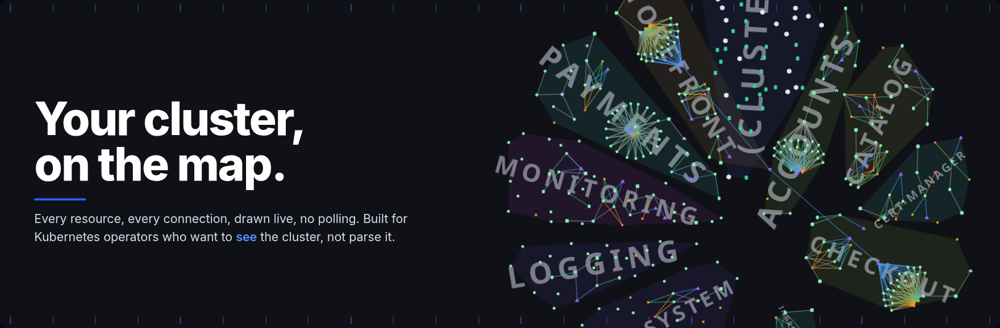
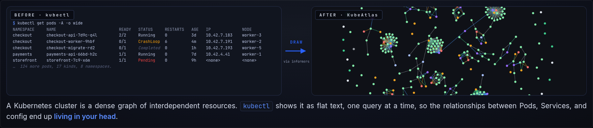
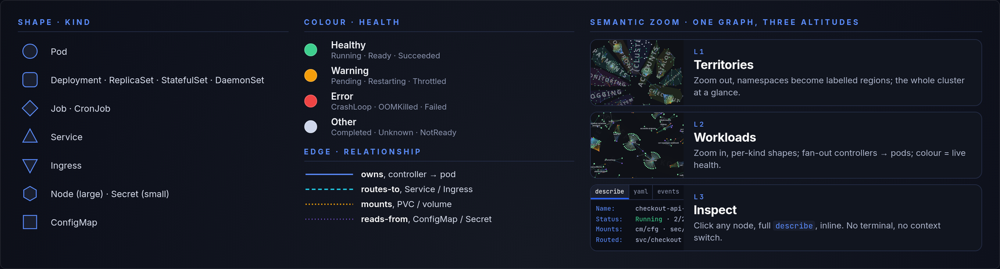
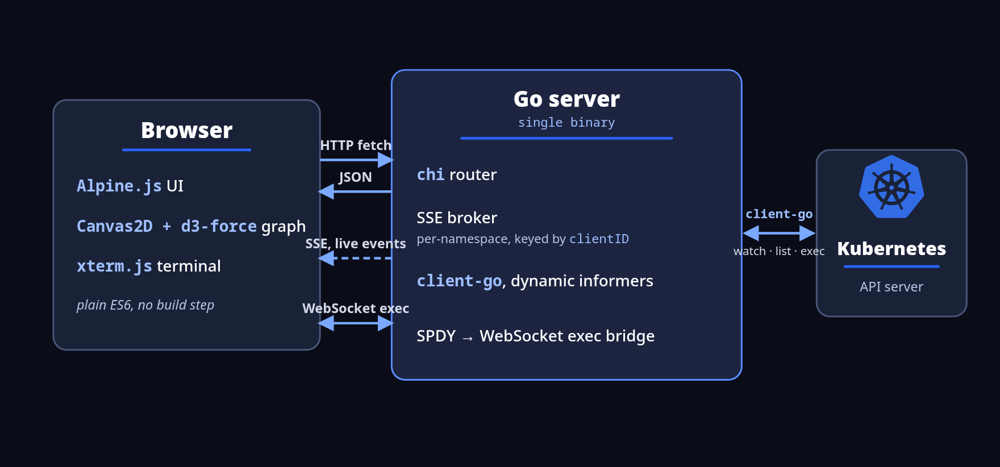

<div align="center">

# KubeAtlas

### A real-time, interactive map for Kubernetes

**Your cluster, on the map.** Every resource, every connection, drawn live — no polling.
A focused visual layer for operators who want to *see* the cluster, not parse it — deliberately bounded to stay fast and safe.

[](LICENSE)


**[▶ View the showcase](https://kubeatlas-org.github.io/kubeatlas/)**



**Keyboard-driven** vim-style nav · **No build step** plain ES6, one binary · **Safe by design** secrets redacted, drain excluded · **Narrow on purpose** watch · diagnose · operate

</div>

> This repository is the **demo-day public release** — a snapshot of the project for showcase and review. It's a local development companion, not a production deployment target.

---

## From text to map

A Kubernetes cluster is a dense graph of interdependent resources. `kubectl` shows it as flat text, one query at a time, so the relationships between Pods, Services, and config end up *living in your head*. KubeAtlas connects to the API, watches every resource, and streams every change live — drawn as one map, in your browser.

<div align="center">

</div>

---

## How to read the map

KubeAtlas encodes cluster state into **shape** (kind), **colour** (health), and **edge** (relationship) — and a single semantic-zoom graph reads at three altitudes: namespace **territories**, per-kind **workloads**, and click-to-**inspect**.

<div align="center">

</div>

Explore your cluster through the layer logic. One graph, redrawn as you zoom:
- **L1 · Territories** — namespaces collapse into labelled regions; the whole cluster at a glance.
- **L2 · Workloads** — per-kind shapes resolve, controllers fan out to their pods, colour tracks live health.
- **L3 · Inspect** — click any node for a full `describe` inline. No terminal, no context switch.

---

## What you do with it

- **See it** — cluster state and every relationship, at a glance, live.
- **Diagnose it** — logs · `describe` · metrics · events. No terminal, no context switch.
- **Operate it** — scale · restart · `exec`, in place. Dangerous ops (drain, cordon, bulk delete) excluded by design.

---

## Inside the binary

One Go binary — the frontend is embedded with `go:embed`, so `make build` produces a single self-contained executable you can copy to any host with a kubeconfig and run. Stateless on writes, cache-first on reads:

1. The browser opens an SSE stream and joins a broker group per namespace, keyed by `clientID`.
2. `client-go` informers watch every kind; each add / update / delete is serialized once and fanned to that group.
3. The table and graph render from one in-memory store, so both stay live — no polling, and a reconnect resyncs from cache.
4. Mutations go over REST with an `X-Client-ID`; `exec` rides a WebSocket bridged to the API server.

<div align="center">

</div>

### How connections are inferred

Edges aren't stored — KubeAtlas re-derives them on every change by reading references off each object and resolving them against the cache (by UID, name, or pod IP):

- **owns** — `ownerReferences` (controller → pod, walked up the chain); HPAs link to their `scaleTargetRef`.
- **routes-to** — Ingress → Service (rule backends); Service → Pod, resolved through Endpoints / EndpointSlices by pod IP.
- **mounts** — a Pod's `volumes[]` → the PVC, ConfigMap, or Secret they name.
- **reads-from** — a container's `env[].valueFrom` → the Secret or ConfigMap key it references.

---

## Quick start

**Run a release binary** — grab the archive for your OS/arch from [Releases](https://github.com/kubeatlas-org/kubeatlas/releases) (linux / macOS / Windows × amd64 / arm64), extract, and run. The frontend is embedded, so it's a single self-contained file — no other dependencies beyond a reachable cluster via your local kubeconfig:

```bash
./kubeatlas               # → http://127.0.0.1:8000
```

Working on KubeAtlas itself? See **[DEVELOPMENT.md](DEVELOPMENT.md)** for the dev server, throwaway test clusters, and tooling.

Configuration is via environment variables:

| Variable           | Default          | Description                                                 |
|--------------------|------------------|-------------------------------------------------------------|
| `PORT`             | `8000`           | Server listen port                                          |
| `BIND_ADDRESS`     | `127.0.0.1`      | Bind interface (warns loudly if set to a non-loopback addr) |
| `SINGLE_NAMESPACE` | _empty_          | Restrict the server to a single namespace                   |
| `NAMESPACE_FILTER` | _empty_          | Regex of namespaces to hide                                 |
| `DISABLE_POD_LOGS` | `false`          | Disable the log streaming endpoints                         |
| `LOG_LEVEL`        | `info`           | `debug` / `info` / `warn` / `error`                         |
| `LOG_FORMAT`       | `text`           | `text` (human-readable) or `json` (one event per line)      |
| `STATIC_DIR`       | _empty_          | Serve the frontend from this dir on disk (dev)              |
| `KUBECONFIG`       | `~/.kube/config` | Standard client-go kubeconfig path                          |

---

## Security model

KubeAtlas is **local-only by default**. The boundary is the loopback bind plus the kubeconfig user's RBAC — there is no built-in authentication. The threat model assumes a trusted operator on a trusted machine; don't expose KubeAtlas to a network.

- Binds `127.0.0.1`; non-loopback binds emit a loud startup warning.
- A host-validation middleware rejects `Host` headers other than `localhost`, `127.0.0.1`, or the configured `BIND_ADDRESS` (DNS-rebinding mitigation).
- All mutating routes require an `X-Client-ID` header — the same UUID the client uses for SSE grouping.
- `ReadHeaderTimeout = 5s` (slowloris mitigation).
- Secret and ConfigMap `data` fields are redacted server-side before YAML export.

---

## Proof of concept

Validated on two reproducible, **KWOK-simulated** clusters that seed in about a minute:

- **Production-shaped** — 19 nodes, ~130 pods, StatefulSets with PVCs, sidecars, and live metrics.
- **Fault-injected** — CrashLoop, OOMKilled, ImagePullBackOff, Pending, stuck-Terminating, and a NotReady node, each failure pinned by a label-keyed KWOK Stage so it does not self-heal during a walkthrough.

Every state was verified end-to-end through the live interface. Rendering uses **Canvas2D + d3-force** with viewport culling and a uniform-grid spatial index; semantic-zoom LOD keeps the graph legible from the namespace-territory view down to individual pods.

---

## Tech stack

**Kubernetes** · **Go** · **Alpine.js** · **d3-force** · **Canvas2D / JavaScript**

`chi` · SSE · WebSocket · xterm.js · client-go · KWOK

---

## Licence

MIT — see [LICENSE](LICENSE).

## Special thanks

KubeAtlas began as a fork of [KubeView](https://github.com/benc-uk/kubeview) by Ben Coleman, with its graph view inspired by [Obsidian](https://obsidian.md)'s.

Thanks also to [k9s](https://github.com/derailed/k9s) for the minimalist take on Kubernetes management.

Built as a graduation project (CENG 402 · 2025–26) at Ankara Yıldırım Beyazıt University, Department of Computer Engineering, by **Ahmet Kaan Demirci** and **Emin Salih Açıkgöz** — with thanks to our supervisor, **Asst. Prof. Mustafa Yeniad**.
