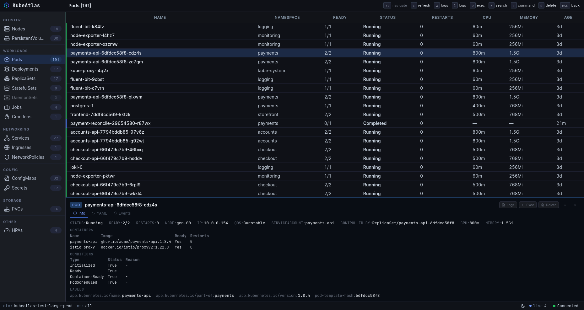
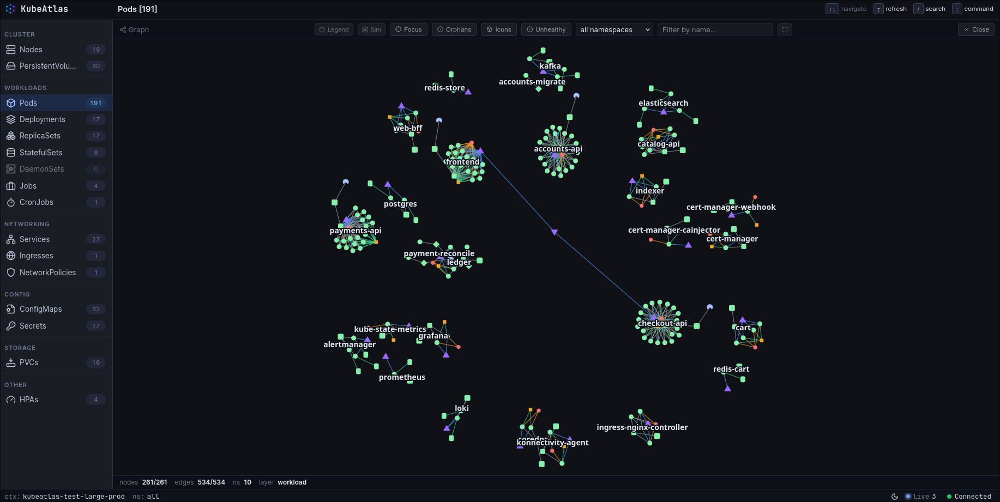

# KubeAtlas

A browser-based observability and operations tool for Kubernetes. A Go backend watches the cluster with `client-go` informers and streams live state to a vanilla-JavaScript frontend over Server-Sent Events. The frontend renders both k9s-style resource tables and a force-directed topology graph, with the same data and the same live updates underneath.

<p align="center">
  
</p>

> This repository is the **demo-day public release** — a snapshot of the project for showcase and review. It is intended as a local development companion, not a production deployment target.

## Features

**Observe.** Real-time resource tables across 17 kinds (Pods, Deployments, ReplicaSets, StatefulSets, DaemonSets, Jobs, CronJobs, Services, Ingresses, NetworkPolicies, ConfigMaps, Secrets, PVCs, HPAs, Nodes, PersistentVolumes, Events) with live add / update / remove over SSE. A Canvas2D + d3-force topology graph encodes kind (shape), health (colour) and relationship (edge style — owner / network / mount / env-ref). Drill-down navigation with breadcrumbs, instant search across columns, a vim-style command palette, and light / dark themes.

**Diagnose.** Multi-container pod log streaming with follow, search/highlight, previous-container and timestamp toggles. A read-only, syntax-highlighted YAML viewer (Secret / ConfigMap `data` redacted server-side). A per-resource events tab and a namespace events dialog. Pod and node CPU / memory metrics columns (requires `metrics-server`).

**Operate.** Scale Deployments / ReplicaSets / StatefulSets; rollout restart Deployments / StatefulSets / DaemonSets; delete with a hold-to-confirm gesture; interactive web shell over WebSocket + xterm.js; in-browser YAML edit & apply; kubeconfig context switching and dynamic CRD discovery. Dangerous operations (drain, cordon, bulk delete) are deliberately excluded.

### The graph

The graph view scales by zoom. At a distance, namespaces appear as labelled regions; zoom in and per-kind shapes resolve, with controllers fanning out to their pods. Click any node and the detail pane opens a full `describe` — conditions, containers, events, YAML — without leaving the view. Edge-class toggles at the top of the canvas filter by relationship (owner / network / mount / env-ref).

<p align="center">
  
</p>

## Architecture at a glance

One Go binary. Informers watch the API; an SSE broker fans live events to browser clients, scoped per namespace. The server is stateless on the mutation path and cache-first on reads. The only per-client state is broker group membership keyed by `clientID`.

```
 ┌───────────────┐   watch    ┌─────────────────────────────┐
 │ kube-apiserver│◀───────────│ client-go dynamic informers │
 └───────┬───────┘    list    │  (17 kinds, 1-min resync)   │
         │                    └──────────────┬──────────────┘
         │ /exec (SPDY)                      │ Add / Update / Delete
         │ /log                              ▼
         │                    ┌──────────────────────────────┐
         │                    │  SSE broker (per-ns groups + │
         │                    │  "_all_" fan-out, 10s ping)  │
         │                    └──────────────┬───────────────┘
         │                                   │ text/event-stream
         ▼                                   ▼
 ┌─────────────────────────────────────────────────────────────┐
 │           Go HTTP server  (chi, :8000, 127.0.0.1)           │
 │  middleware: host-validation · X-Client-ID · slog request   │
 └─────────────────────────────────────────────────────────────┘
                              │
              ┌───────────────┼────────────────┐
       SSE    │      REST     │      WebSocket │
        ▼     ▼               ▼                ▼
 ┌─────────────────────────────────────────────────────────────┐
 │  Browser: Alpine.js · ES6 modules · no bundler              │
 │   cache.js (UID / name / IP indexes)                        │
 │    ├─▶ table.js / columns.js     (k9s-style)                │
 │    ├─▶ graph-canvas.js           (Canvas2D + d3-force)      │
 │    └─▶ exec-client.js            (xterm.js + binary WS)     │
 └─────────────────────────────────────────────────────────────┘
```

## Backend

Go 1.24, [chi](https://github.com/go-chi/chi) router, `client-go` dynamic informers, `log/slog` with per-request context, hot-reload via `air`. Package layout:

| Path | Responsibility |
|------|----------------|
| `server/main.go`               | Bootstrap: config → logging → Kubernetes service → chi router → `http.Server` |
| `server/routes.go`             | Route registration; SPA / static handlers |
| `server/routes_sse.go`         | `/updates` (SSE handshake) and `/api/fetch/{ns}` (group switch) |
| `server/routes_resources.go`   | YAML get / apply, delete |
| `server/routes_logs.go`        | Pod logs, follow mode |
| `server/routes_metrics.go`     | `metrics.k8s.io/v1beta1` proxy |
| `server/routes_ops.go`         | Scale, rollout restart, context switch |
| `server/routes_crds.go`        | CRD discovery + instance listing |
| `server/exec.go`               | WebSocket upgrade + binary frame multiplexing |
| `server/middleware.go`         | Host validation, X-Client-ID guard, slowloris timeout |
| `server/services/kubernetes.go`| Informer factories (namespaced + cluster-scoped), CRD registry |
| `server/services/broker.go`    | SSE broker wrapper (namespace groups + `_all_`) |
| `server/services/events/`      | Informer handler factories — JSON-serialize + fan out |
| `server/services/exec.go`      | SPDY executor bridge to apiserver `/exec` |
| `server/logging/`              | slog handler with `request_id` / `client_id` propagation |

### Real-time data plane

The SSE broker is the spine of the read path:

1. The frontend mints a UUID `clientID` and opens `EventSource('/updates?clientID=<uuid>')`. The handshake registers the client in the broker.
2. When the user opens a namespace, the frontend calls `GET /api/fetch/{namespace}`. The handler calls `broker.MoveClientToGroup(clientID, ns)`, so the client is now in exactly **one** namespace group plus the implicit `_all_` group.
3. Every informer `AddFunc / UpdateFunc / DeleteFunc` (`server/services/events/events.go`) serializes the unstructured object to JSON once and calls `broker.SendToGroup(ns, ev)` followed by `broker.SendToGroup("_all_", ev)`. Cluster-scoped kinds emit only into `_all_`.
4. A 10-second heartbeat keeps proxies and middleboxes from closing idle connections. Backpressure policy is *drop on saturated client* — there is no per-client queue, since the cache layer can resync any missed event on reconnect.

### Informers & resource model

Two `DynamicSharedInformerFactory` instances are wired in `services/kubernetes.go`:

- **Namespaced factory:** Pods, Services, Deployments, ReplicaSets, StatefulSets, DaemonSets, Jobs, CronJobs, Ingresses, NetworkPolicies, Events, HPAs, PVCs, ConfigMaps, Secrets, EndpointSlices.
- **Cluster factory:** Nodes, PersistentVolumes.

Resync period is one minute; `WaitForCacheSync` blocks startup for up to 60 seconds. CRDs are discovered at startup via the `apiextensions` API and recorded in an in-memory registry keyed by GVR; `routes_crds.go` exposes them at `/api/crds` and `/api/crds/{group}/{version}/{resource}/{ns}`.

`POST /api/contexts/switch` does **not** mutate informer state in place — it tears down the whole Kubernetes service and rebuilds it (new REST client, new informers, fresh broker groups). Multi-cluster fan-in is deliberately out of scope.

### HTTP endpoints

| Method | Path | Notes |
|--------|------|-------|
| `GET`  | `/updates` | SSE stream; requires `?clientID=<uuid>` |
| `GET`  | `/api/namespaces` | Cluster metadata + namespace list |
| `GET`  | `/api/fetch/{namespace}` | Snapshot + join namespace SSE group |
| `GET`  | `/api/fetch-cluster` | Cluster-scoped snapshot (Nodes, PVs) |
| `GET`  | `/api/logs/{namespace}/{podname}` | Logs; `?follow=true&container=&previous=&timestamps=&max=` |
| `GET`  | `/api/resource/{namespace}/{kind}/{name}/yaml` | Export YAML (Secret/CM `data` redacted) |
| `PUT`  | `/api/resource/{namespace}/{kind}/{name}/yaml` | Apply YAML · **requires `X-Client-ID`** |
| `DELETE` | `/api/resources/{namespace}/{kind}/{name}` | Delete · **requires `X-Client-ID`** |
| `GET`  | `/api/metrics/{namespace}/pods` | `metrics.k8s.io` pod proxy |
| `GET`  | `/api/metrics/nodes` | `metrics.k8s.io` node proxy |
| `PUT`  | `/api/resources/{namespace}/{kind}/{name}/scale` | Scale replicas · **requires `X-Client-ID`** |
| `POST` | `/api/resources/{namespace}/{kind}/{name}/restart` | Rollout restart · **requires `X-Client-ID`** |
| `GET`  | `/api/crds` | List discovered CRDs |
| `GET`  | `/api/crds/{group}/{version}/{resource}/{namespace}` | List CRD instances |
| `POST` | `/api/contexts/switch` | Rebuild service against a different kubeconfig context |
| `GET`  | `/ws/exec/{namespace}/{pod}` | WebSocket upgrade (binary protocol below) |

### Exec endpoint (WebSocket binary protocol)

`server/exec.go` defines three single-byte frame types:

| Opcode | Direction | Payload |
|--------|-----------|---------|
| `0x00` `frameData`   | both         | Raw PTY bytes (stdin on the way in, stdout on the way out) |
| `0x01` `frameResize` | client→server | `uint16` LE cols, `uint16` LE rows |
| `0x02` `frameError`  | server→client | UTF-8 error text |

Bridged to the apiserver via `remotecommand.NewSPDYExecutor(...).StreamWithContext()`. A 4-slot `TerminalSizeQueue` carries resize events; closing the WebSocket EOFs the exec stdin pipe.

### Log streaming

`server/services/logs.go` calls `clientset.CoreV1().Pods(ns).GetLogs(...)` and copies the stream through a flushing `ResponseWriter` wrapper so the browser sees lines as they arrive. Multi-container pods select the container via `?container=`.

## Frontend

Plain ES6 modules — no bundler, no transpilation, no build step. Alpine.js provides reactivity; the rest is hand-rolled. Module map:

| File | Role |
|------|------|
| `public/index.html`              | SPA shell; inline pre-CSS theme boot to avoid flash |
| `public/js/main.js`              | Alpine root (`mainApp`) — ~80 reactive properties |
| `public/js/events.js`            | EventSource lifecycle → `CustomEvent('kubeEvent')` |
| `public/js/cache.js`             | In-memory store: UID / `kind:name` / IP indexes |
| `public/js/table.js` + `columns.js` | k9s-style table; per-kind column schemas |
| `public/js/graph-canvas.js`      | Canvas2D + d3-force; edge classes `--edge-{owner,network,mount,env}` |
| `public/js/command-palette.js`   | Vim `:` prompt — `:ns`, `:ctx`, kind jumps |
| `public/js/exec-client.js`       | xterm.js + binary WS framing |
| `public/js/logs-stream.js`       | ReadableStream consumption + `<mark>` highlight |
| `public/css/main.css`            | Design tokens (`--bg-*`, `--text-*`, `--edge-*`); `[data-theme]` switch |
| `public/ext/`                    | Vendored: Alpine, d3-force, xterm.js, Prism (YAML), Inter, JetBrains Mono |

The graph runs a continuous low-alpha d3-force simulation. Initial layout does up to 500 pre-ticks within a 350 ms budget before the reveal animation, then settles in place. Semantic-zoom LOD swaps namespace territories → workload labels → pod labels at fixed zoom thresholds; the official Kubernetes icon set is overlaid at zoom ≥ 0.28 when node count ≤ 500.

## Security model

KubeAtlas is **local-only by default**. The boundary is the loopback bind plus the kubeconfig user's RBAC — there is no built-in authentication.

- Binds `127.0.0.1`; non-loopback binds emit a loud startup warning.
- `hostValidationMiddleware` rejects requests whose `Host` header is not `localhost`, `127.0.0.1`, or the configured `BIND_ADDRESS` (DNS-rebinding mitigation; bypassed only when `BIND_ADDRESS=0.0.0.0`).
- All mutating routes require an `X-Client-ID` header — the same UUID the client uses for SSE grouping.
- `http.Server.ReadHeaderTimeout = 5s` (slowloris mitigation).
- Secret and ConfigMap `data` fields are redacted server-side before YAML export so they cannot leak through the read path.

The threat model assumes a trusted operator on a trusted machine. Do not expose KubeAtlas to a network.


## Quick start

Prerequisites: **Go ≥ 1.24** and a reachable Kubernetes cluster via your local kubeconfig.

```bash
make run     # hot-reload dev server via air → http://127.0.0.1:8000
make build   # produces ./bin/kubeatlas
make lint    # golangci-lint
```

Configuration is via environment variables:

| Variable           | Default          | Description                                                 |
|--------------------|------------------|-------------------------------------------------------------|
| `PORT`             | `8000`           | Server listen port                                          |
| `BIND_ADDRESS`     | `127.0.0.1`      | Bind interface (warns loudly if set to a non-loopback addr) |
| `SINGLE_NAMESPACE` | _empty_          | Restrict the server to a single namespace                   |
| `NAMESPACE_FILTER` | _empty_          | Regex of namespaces to hide                                 |
| `DISABLE_POD_LOGS` | `false`          | Disable the log streaming endpoints                         |
| `LOG_LEVEL`        | `info`           | `debug` / `info` / `warn` / `error`                         |
| `LOG_FORMAT`       | `text`           | `text` (human-readable) or `json` (one event per line)      |
| `KUBECONFIG`       | `~/.kube/config` | Standard client-go kubeconfig path                          |

## Licence

MIT — see [LICENSE](LICENSE).
